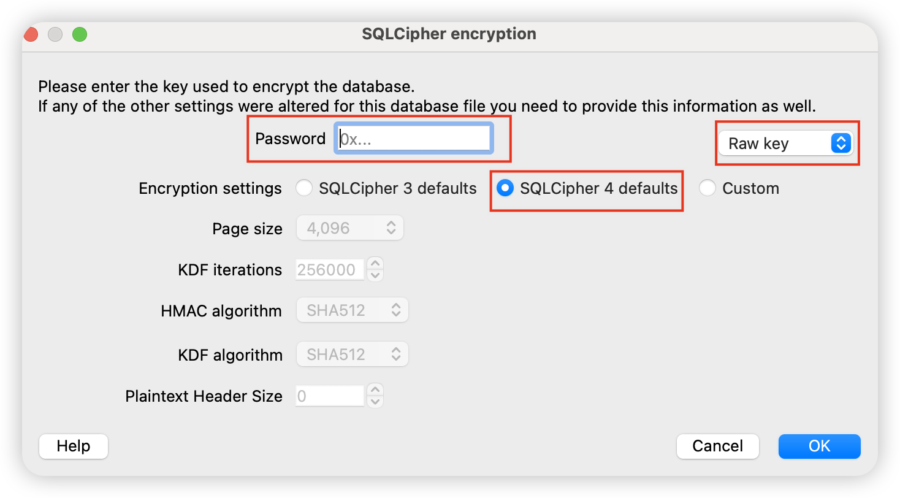
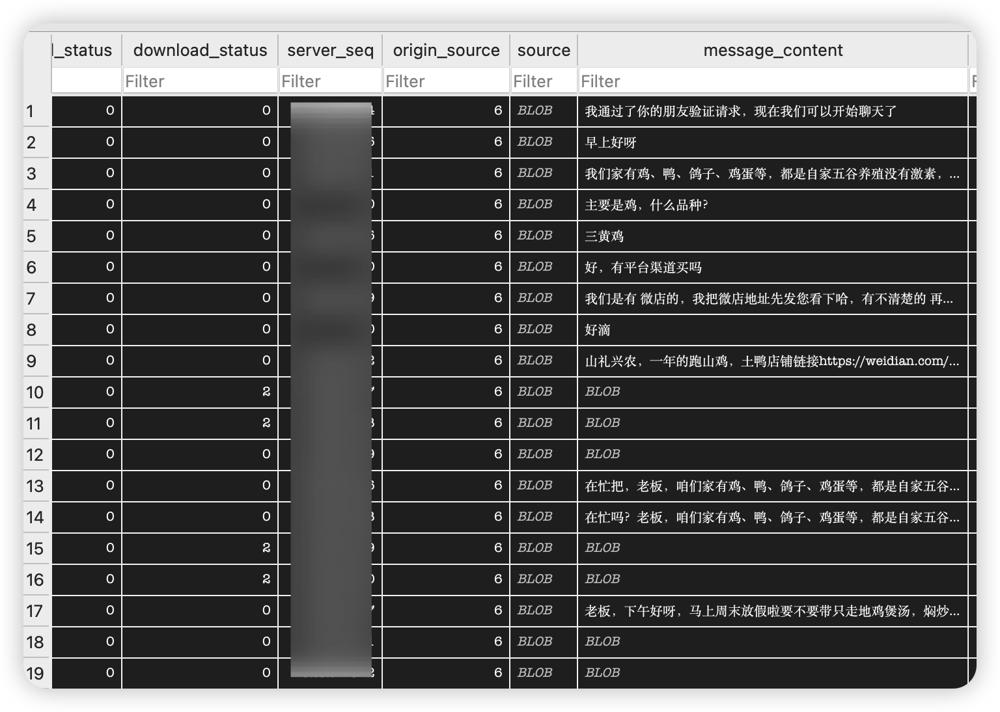

# 微信 mac 数据库解密

微信的数据库是 sqlite，用 sqlcipher 加密，所以要想读取其中消息，必须解密，而要解密就要拿到 sqlcipher key。在新版微信中，网上的方法都已失效，只能自己搞了。

首先记得 csrutil disable，然后微信先登录，然后退出登录到二维码界面，命令行执行 lldb -p $(pgrep WeChat)，下面就可以开始分析了。

微信用的是自己封装的 WCDB 库（开源的），看其代码可知设置 sqlcipher key 的地方在 [setCipherKey](https://github.com/Tencent/wcdb/blob/7395f2045f685c8b366bc29e29c3e8daa4d29909/src/common/core/cipher/CipherHandle.cpp#L57)，但二进制里做了混淆找不到这个函数了，不过这函数里用到了字面量 [`x’`](https://github.com/Tencent/wcdb/blob/7395f2045f685c8b366bc29e29c3e8daa4d29909/src/common/core/cipher/CipherHandle.cpp#L62) 和 `Malloc memory for cipher fail` 等常量，可以反推函数，但遗憾的是前者太多了，后者又找不到。

然而有个线索是 `void *buffer = malloc(67 * sizeof(unsigned char));`，所以我们可以直接找这个 malloc(67) 调用，看看哪个函数调用了它。也就是说，WeChat 这个二进制的 text 段里，会出现 `mov x0/w0, #0x43` + `bl malloc # maybe stub` 这样的指令（67 的十六进制是 0x43），我们直接找这个指令（这里代码啥的让 AI 写）。

很幸运，整个二进制只有一个地方符合要求，那么在这个地址打断点，找到后，栈上的第一个 WeChat 函数是 `___lldb_unnamed_symbol244117`，那么它大概率就是 `setCipherKey` 的混淆内联版本了。

执行 `bt` 发现现在的栈顶是函数 ___lldb_unnamed_symbol244117，那么这个函数大概率就是 setCipherKey 的混淆内联版本：


然后我们删除刚才的断点，并且在这个函数上打个断点 br set -n ___lldb_unnamed_symbol244117，继续执行到断点。

看源码参数传的是个 UnsafeData，这个结构由俩字段，一个长度、一个字符串本身，那么我们偏移掉长度，去读取字符串：

```bash
memory read -f A $x1+8 然后 memory read -f s 0x0000600001be9ab0
```


看着行得通。

hash 后的密钥长度换算成 10 进制就是 99，但从源码注释中我们知道，除去包围的 x’ 和 ’，其余 96 字符中，前 64 字符是真正的密钥，而后 32 字符是 salt，从[开源的 windows 版微信解密](https://github.com/ylytdeng/wechat-decrypt/blob/73598751a0cec2d8eb7487a6af8a4cdcf008bd54/find_all_keys.py#L99)中我们知道，微信有多个 db，每个 db 都有自己的密钥和 salt，然后 salt 就是用于将密钥和 db 文件对应起来的 id。

所以咱直接抄代码，获取所有的 salt → db file：

```python
# 摘抄自 https://github.com/ylytdeng/wechat-decrypt/blob/73598751a0cec2d8eb7487a6af8a4cdcf008bd54/find_all_keys.py#L99
import os

# NOTE: ！！！替换成你自己的路径！！！
DB_DIR = '/Users/xxxx/Library/Containers/com.tencent.xinWeChat/Data/Documents/xwechat_files/xxx/db_storage'
PAGE_SZ = 4096
SALT_SZ = 16
db_files = []
salt_to_dbs = {}  # salt_hex -> [(rel_path, db_page1), ...]

for root, dirs, files in os.walk(DB_DIR):
    for f in files:
        if f.endswith('.db') and not f.endswith('-wal') and not f.endswith('-shm'):
            path = os.path.join(root, f)
            rel = os.path.relpath(path, DB_DIR)
            sz = os.path.getsize(path)
            if sz < PAGE_SZ:
                continue
            with open(path, 'rb') as fh:
                page1 = fh.read(PAGE_SZ)
            salt = page1[:SALT_SZ].hex()
            db_files.append((rel, path, sz, salt, page1))
            if salt not in salt_to_dbs:
                salt_to_dbs[salt] = []
            salt_to_dbs[salt].append(rel)

print(salt_to_dbs)
```

用 `DB Browser for SQLite` 打开 db 文件，改下选项，在 Password 中输入 `0x` 加上咱拿到的密钥，如果能打开说明这个密钥是对的。




剩下的就是让微信持续运行、触发断点，然后我们收集齐所有数据库的密钥。

最后，我让 AI 整理了个自动化脚本儿 [find_key.py](./find_key.py)，放在这个 repo 里了，大家可以直接用。

最后的最后，其实还有暴力内存检索 `x'...'` 的方法，一些开源项目也在用，供参考。
